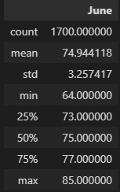
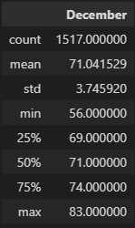

# Surfs Up Weather Analysis
### Overview
In this analysis we analyse data from Oahu, Hawaii, to decide whether or not opening a surf shop is a good idea, and if it is expandable. Mr. W. Avy, my investor, is wondering if the weather conditions are stable, and he especially wants me to aquire about the months of June and December.

### Results

##### June

- 1700 data points.
- The average temperature is 75 degrees fahrenheit.
- The temerature varies between 64 and 85 degrees fahrenheit.

##### December

- 1517 data points.
- The average temperature is 71 degrees fahrenheit.
- The temerature varies between 56 and 83 degrees fahrenheit.

### Summary

The average temperatures in June and December are not much different from each other, with temperatures in the 70's, and December averaging about 4 degrees colder than June. For a more in-depth analysis, it would be a good idea to inquire about the difference in rainfall in June and December, as well as how many days it rains in each of the months.

### Resources
- Python 3.7.x
- Jupyter Notebook
- SQLite
- SQLalchemy
